# Part-Time Work & Living Marketplace Platform - Database Architecture

Target database: PostgreSQL 15+ with optional PostGIS for geospatial search and pgvector for AI embeddings.

## Execution Order

Run the files in numeric order:

1. `00_extensions_enums.sql`
2. `01_identity_access.sql`
3. `02_location.sql`
4. `03_worker_profile.sql`
5. `04_job_marketplace.sql`
6. `05_matching_ai.sql`
7. `06_accommodation.sql`
8. `07_food_service.sql`
9. `08_communication.sql`
10. `09_payments.sql`
11. `10_reviews_admin_analytics.sql`
12. `98_table_comments.sql`
13. `99_indexes.sql`

## Architecture Summary

The design uses relational normalization for core transactional data and generic extension patterns where the product needs flexibility. Users can hold multiple roles, and role-specific modules extend the base `users` record without duplicating identity data. Marketplace listings, conversations, reviews, payments, complaints, analytics, and AI events are modeled so future modules can be added without reshaping the whole platform.

Key decisions:

- Use UUID primary keys for horizontal scaling, sharding readiness, and safer public references.
- Use role and permission tables for RBAC.
- Keep locations reusable through country, state, city, area, and coordinate tables.
- Use generic review, attachment, notification, complaint, analytics, and entity embedding tables.
- Use JSONB only for flexible metadata, AI explanations, preferences, and provider payloads; core business fields remain relational.
- Use PostGIS geography columns where available for nearby search.
- Keep files separated by domain to support future microservice extraction.

## ER Diagram

```mermaid
erDiagram
    USERS ||--o{ USER_ROLES : has
    ROLES ||--o{ USER_ROLES : assigned
    ROLES ||--o{ ROLE_PERMISSIONS : grants
    PERMISSIONS ||--o{ ROLE_PERMISSIONS : included
    USERS ||--o{ USER_SESSIONS : opens
    USERS ||--o{ VERIFICATIONS : completes
    USERS ||--|| USER_PROFILES : owns
    USERS ||--o{ AUDIT_LOGS : performs

    USERS ||--o| WORKER_PROFILES : extends
    WORKER_PROFILES ||--o{ WORKER_SKILLS : has
    SKILLS ||--o{ WORKER_SKILLS : tagged
    WORKER_PROFILES ||--o{ WORKER_AVAILABILITY : declares
    WORKER_PROFILES ||--o{ WORKER_EXPERIENCE : lists
    WORKER_PROFILES ||--o{ WORKER_EDUCATION : lists
    WORKER_PROFILES ||--o{ WORKER_DOCUMENTS : uploads

    USERS ||--o{ EMPLOYER_PROFILES : owns
    EMPLOYER_PROFILES ||--o{ JOBS : posts
    JOB_CATEGORIES ||--o{ JOBS : categorizes
    JOBS ||--o{ JOB_SKILLS : requires
    SKILLS ||--o{ JOB_SKILLS : required
    JOBS ||--o{ JOB_SCHEDULES : schedules
    JOBS ||--o{ JOB_LOCATIONS : located_at
    JOBS ||--o{ JOB_APPLICATIONS : receives
    WORKER_PROFILES ||--o{ JOB_APPLICATIONS : submits
    JOB_APPLICATIONS ||--o| SHORTLISTS : may_be
    JOB_APPLICATIONS ||--o| CONTRACTS : results_in

    COUNTRIES ||--o{ STATES : contains
    STATES ||--o{ CITIES : contains
    CITIES ||--o{ AREAS : contains
    AREAS ||--o{ LOCATIONS : contains

    USERS ||--o{ ACCOMMODATION_PROVIDERS : owns
    ACCOMMODATION_PROVIDERS ||--o{ PROPERTIES : manages
    PROPERTIES ||--o{ ROOMS : contains
    ROOM_TYPES ||--o{ ROOMS : classifies
    PROPERTIES ||--o{ PROPERTY_FACILITIES : offers
    FACILITIES ||--o{ PROPERTY_FACILITIES : included
    ROOMS ||--o{ ACCOMMODATION_BOOKINGS : booked

    USERS ||--o{ FOOD_PROVIDERS : owns
    FOOD_PROVIDERS ||--o{ FOOD_ITEMS : sells
    FOOD_PROVIDERS ||--o{ FOOD_PLANS : offers
    FOOD_PLANS ||--o{ FOOD_SUBSCRIPTIONS : subscribed

    USERS ||--o{ CONVERSATION_PARTICIPANTS : joins
    CONVERSATIONS ||--o{ CONVERSATION_PARTICIPANTS : includes
    CONVERSATIONS ||--o{ MESSAGES : contains
    MESSAGES ||--o{ MESSAGE_ATTACHMENTS : has

    USERS ||--o{ PAYMENTS : pays
    PAYMENTS ||--o{ TRANSACTIONS : produces
    INVOICES ||--o{ PAYMENTS : settles

    USERS ||--o{ REVIEWS : writes
    USERS ||--o{ COMPLAINTS : files
    USERS ||--o{ ANALYTICS_EVENTS : emits
    USERS ||--o{ SEARCH_HISTORY : searches
    ENTITY_EMBEDDINGS ||--o{ MATCHING_SCORES : supports
```

## Module Table List

- Identity and access: `users`, `roles`, `permissions`, `user_roles`, `role_permissions`, `user_profiles`, `verifications`, `user_sessions`, `user_preferences`, `audit_logs`
- Location: `countries`, `states`, `cities`, `areas`, `locations`
- Worker profile: `worker_profiles`, `skills`, `worker_skills`, `worker_availability`, `worker_experience`, `worker_education`, `worker_documents`
- Job marketplace: `employer_profiles`, `job_categories`, `jobs`, `job_skills`, `job_locations`, `job_schedules`, `job_applications`, `shortlists`, `hiring_status_history`, `contracts`
- Matching and AI: `matching_scores`, `recommendation_history`, `search_history`, `user_behavior_events`, `entity_embeddings`
- Accommodation: `accommodation_providers`, `properties`, `rooms`, `room_types`, `facilities`, `property_facilities`, `room_availability`, `accommodation_bookings`, `property_images`
- Food service: `food_providers`, `food_items`, `food_plans`, `food_plan_items`, `food_subscriptions`, `delivery_areas`
- Communication: `conversations`, `conversation_participants`, `messages`, `message_attachments`, `notifications`
- Payments: `billing_subscriptions`, `invoices`, `payments`, `transactions`
- Reviews, admin, analytics: `reviews`, `reports`, `complaints`, `analytics_events`

## Relationship Notes

- `users` is the identity anchor. Role-specific records such as `worker_profiles`, `employer_profiles`, `accommodation_providers`, and `food_providers` reference it.
- `roles` and `permissions` are many-to-many through bridge tables, enabling RBAC and future custom roles.
- `jobs` support multiple skills, locations, schedules, applications, workers, and contracts.
- Reviews use polymorphic `target_entity_type` and `target_entity_id`, allowing one reusable review system for worker, employer, hostel, food, and future modules.
- Payments use entity references so the same payment system can charge for postings, bookings, subscriptions, premium listings, training, insurance, and transport.
- AI and analytics tables reference entities generically so new recommendation models can run without schema rewrites.

## Indexing Strategy

- Use unique indexes on email, mobile, role names, permission codes, and normalized lookup codes.
- Use composite indexes for bridge tables and high-cardinality filters such as job status/category/location, applications by job and worker, bookings by room and date range, and messages by conversation.
- Use GIN indexes for JSONB metadata and preference search when necessary.
- Use PostGIS GiST indexes on `locations.geo_point`, `job_locations.geo_point`, and `properties.geo_point`.
- Use vector indexes on `entity_embeddings.embedding` when `pgvector` is enabled.
- Use partial indexes on active/open records such as open jobs, active subscriptions, unread notifications, and available rooms.

## Performance Optimization

- Partition high-volume append-only tables by month: `audit_logs`, `analytics_events`, `user_behavior_events`, `messages`, `notifications`, and `search_history`.
- Cache recommendation outputs in `recommendation_history` with expiration.
- Use read replicas for search-heavy flows and analytics.
- Use materialized views for marketplace discovery pages, but keep canonical transactional data normalized.
- Denormalize only carefully into search indexes such as Elasticsearch/OpenSearch after transactional writes succeed.
- Use queue-based workers for notifications, AI scoring, invoice generation, and analytics ingestion.

## Security Considerations

- Store password hashes only, never plain text passwords.
- Encrypt sensitive document URLs or store only object-storage keys.
- Restrict document access through signed URLs and authorization checks.
- Add row-level security or tenant-aware policies if the product evolves into B2B SaaS.
- Keep audit logs immutable at the application layer.
- Token and verification values should be stored as hashes.
- Separate payment provider payloads from internal payment records and avoid storing raw card data.
- Apply least-privilege database users per service.

## Microservices Migration Path

The files are already aligned to service boundaries:

- Identity Service: `01_identity_access.sql`
- Location Service: `02_location.sql`
- Worker Service: `03_worker_profile.sql`
- Job Marketplace Service: `04_job_marketplace.sql`
- Matching Service: `05_matching_ai.sql`
- Accommodation Service: `06_accommodation.sql`
- Food Service: `07_food_service.sql`
- Communication Service: `08_communication.sql`
- Billing Service: `09_payments.sql`
- Trust, Safety, and Analytics Service: `10_reviews_admin_analytics.sql`

Start with one PostgreSQL database and strict module ownership. Later, extract services using transactional outbox events, API ownership, and eventually separate databases per bounded context.
